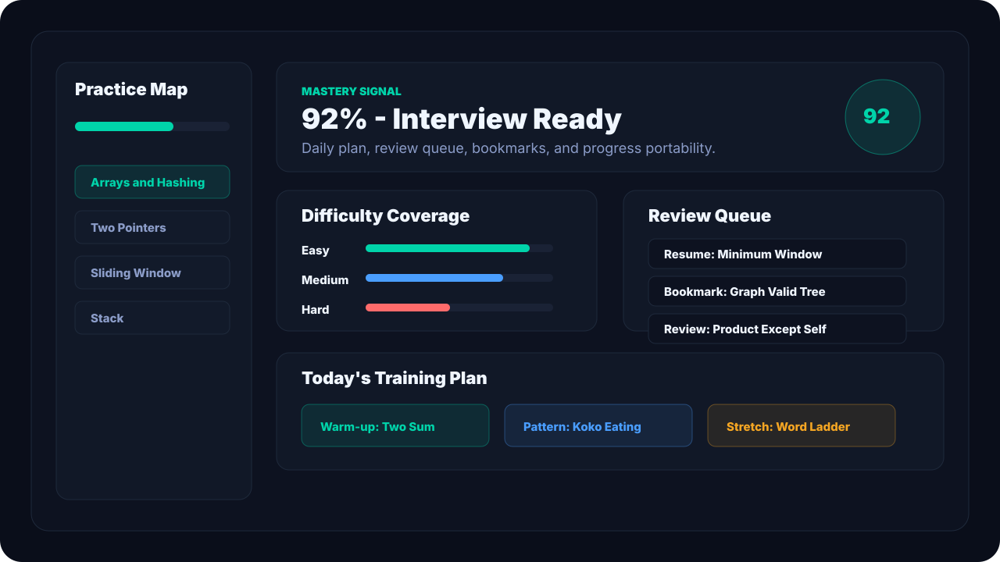

# AlgoVista


**AlgoVista is a visual Data Structures and Algorithms learning platform built to help learners move from intuition to implementation.**

It combines concept lessons, algorithm visualizers, a NeetCode 150 practice deck, guided story mode, code tracing, test execution, mastery analytics, and an optional AI coach backend.

> Live demo: `https://Alan-K-Biju-7.github.io/AlgoVista/`


## Why This Project Stands Out

Most DSA projects are either static notes, a basic algorithm animation, or a simple problem list. AlgoVista is built as a complete learning product:

- 18 interactive visual labs for arrays, stacks, queues, linked lists, trees, graphs, heaps, hashing, tries, sorting, and shortest paths.
- 150 curated coding missions with examples, hints, solutions, and executable test cases.
- Story Mode that explains the mental model before code.
- Trace Mode for supported problems, with visual state snapshots.
- Practice Command Center with mastery score, difficulty coverage, review queue, and a daily training plan.
- Progress export/import/reset for portable local learning state.
- DSA for Beginners roadmap with 100+ concepts.
- Optional Node backend for auth, synced progress, and live AI provider support.
- Static demo fallback so the deployed frontend still works in guest mode without backend setup.

## Screenshots

### Practice Command Center



### Simulator Workspace


## Core Features

| Area | What It Does |
| --- | --- |
| DSA Path | Beginner-to-advanced concept roadmap with progress states |
| Concepts | Fast topic reference with complexity and simulator links |
| Simulator | Visual labs for data structures and algorithms |
| Practice | NeetCode 150-style mission deck with filters, bookmarks, tests, traces, and story mode |
| Command Center | Mastery analytics, review queue, training plan, and progress portability |
| AI Coach | Backend-powered coach with a static offline tutor fallback |
| Backend | Local Node API for auth, progress sync, and OpenAI-compatible coach providers |

## Tech Stack

- React 19
- React Router
- JavaScript
- CSS modules by feature area
- Create React App build pipeline
- Node.js backend using built-in `http`, `crypto`, and `fs`
- Local storage for guest practice progress
- File-backed backend storage for local authenticated progress

## Architecture

```text
src/
  components/
  context/
  data/
  layout/
  modules/
    array/
    avl/
    bellmanford/
    bst/
    dijkstra/
    graph/
    hashtable/
    heap/
    linkedlist/
    mergesort/
    quicksort/
    sorting/
    trie/
  pages/
    practice/
      neetcode150/
      tracer/
server/
  index.js
docs/
  assets/
```

## Local Setup

```bash
npm install
npm start
```

Open:

```text
http://localhost:3000
```

Optional backend:

```bash
npm run backend
```

Backend URL:

```text
http://127.0.0.1:8787
```

Optional AI provider:

```bash
cp server/.env.example server/.env
```

Then set:

```env
GROQ_API_KEY=your_key_here
AI_PROVIDER_BASE_URL=https://api.groq.com/openai/v1
AI_PROVIDER_MODEL=llama-3.1-8b-instant
```

Without provider keys, the backend returns a local fallback response. Without the backend, the deployed frontend still shows a static tutor fallback.

## Testing

```bash
npm run test:ci
```

Current verification:

```text
12 test suites passed
53 tests passed
Production build compiled successfully
```

The test suite covers:

- Problem bank integrity
- Reference solution execution
- Practice filtering and sorting
- Story mode generation
- Visual step generation
- Trace engine behavior
- Practice progress persistence and import/export
- Route-level app flows
- API client error handling

## Production Build

```bash
npm run build:spa
```

This creates:

```text
build/
  index.html
  404.html
  static/
```

The `404.html` copy supports direct visits to client-side routes on static hosts.


- Built **AlgoVista**, a full-stack visual DSA learning platform with 18 interactive algorithm visualizers, a 150-problem practice deck, code tracing, test execution, and mastery analytics.
- Implemented a React-based learning workflow with Story Mode, visual state labs, practice filters, bookmarks, review queues, daily training plans, and local progress portability.
- Designed a Node.js backend with hashed-password auth, bearer-token sessions, file-backed progress sync, and an OpenAI-compatible AI coach endpoint with offline fallback.
- Added CI-ready tests covering problem-bank integrity, reference solution execution, tracer behavior, planner logic, route-level UI flows, API error handling, and local persistence.
- Prepared production deployment for GitHub Pages, Netlify, and Vercel with SPA route fallback and static-demo resilience.

## Repository Highlights

- `src/pages/PracticePage.jsx` - practice command center and mission workflow
- `src/pages/practice/practicePlanner.js` - recommendation, review queue, and training plan logic
- `src/pages/practice/testRunner.js` - in-browser JavaScript test runner for problem solutions
- `src/pages/practice/tracer/` - execution tracing and visualization utilities
- `src/modules/` - interactive DSA visualizers
- `server/index.js` - local backend for auth, progress, static hosting, and AI coaching
- `.github/workflows/deploy.yml` - GitHub Pages CI/CD
- `netlify.toml` and `vercel.json` - free static deployment config

## Project Status

AlgoVista is portfolio-ready as a static deployed demo and local full-stack app.

Remaining production upgrades for a commercial-grade version:

- Hosted persistent database
- Hosted backend service
- Sandboxed multi-language execution
- Real user analytics
- Playwright screenshot regression
- Accessibility audit automation

---

<p align="center">
  <b>AlgoVista - Master DSA by watching it happen.</b>
</p>
