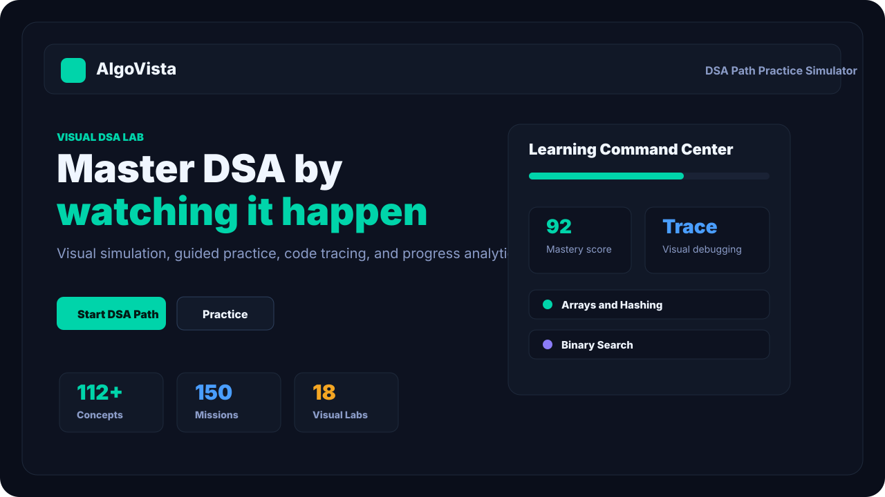
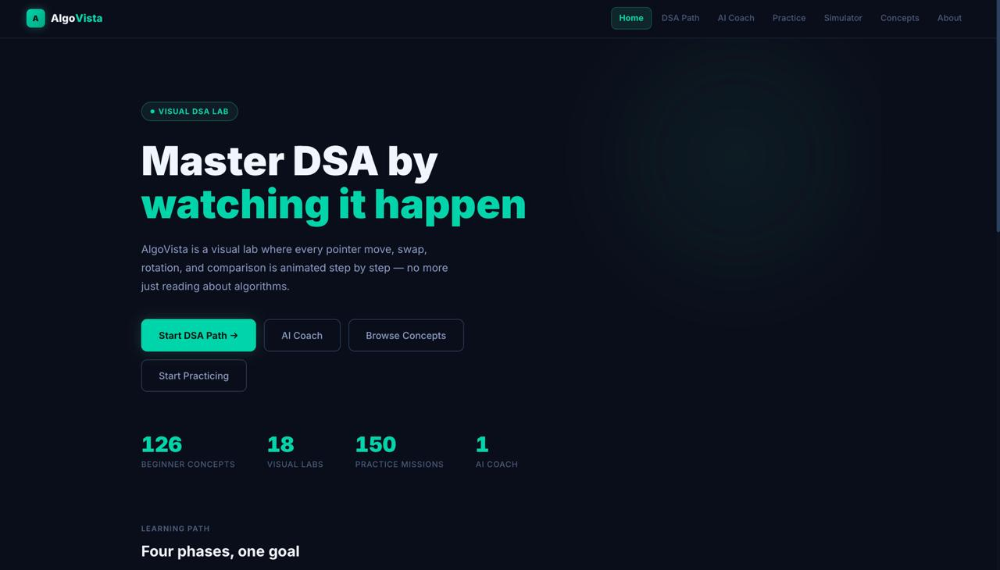
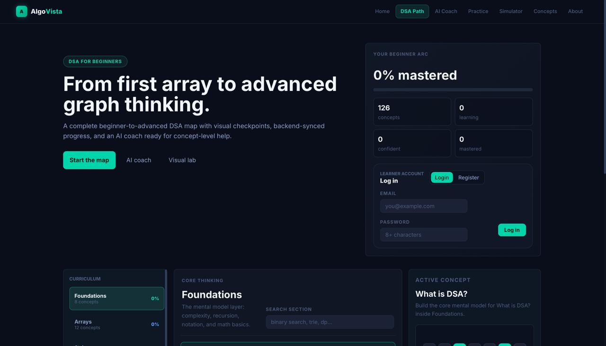
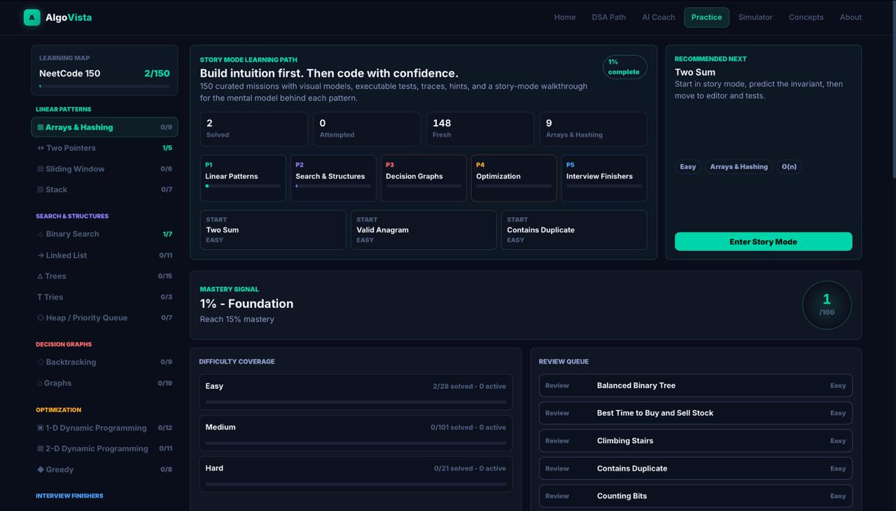
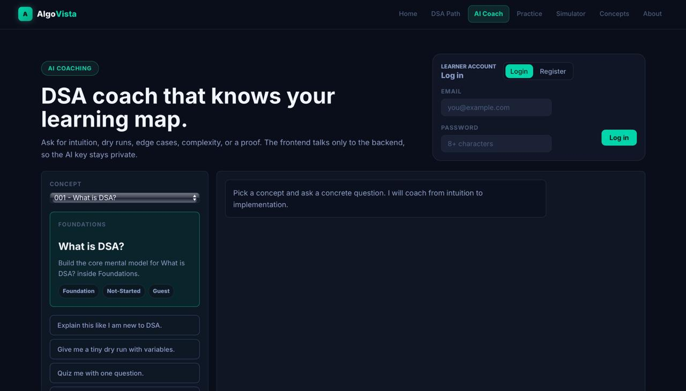
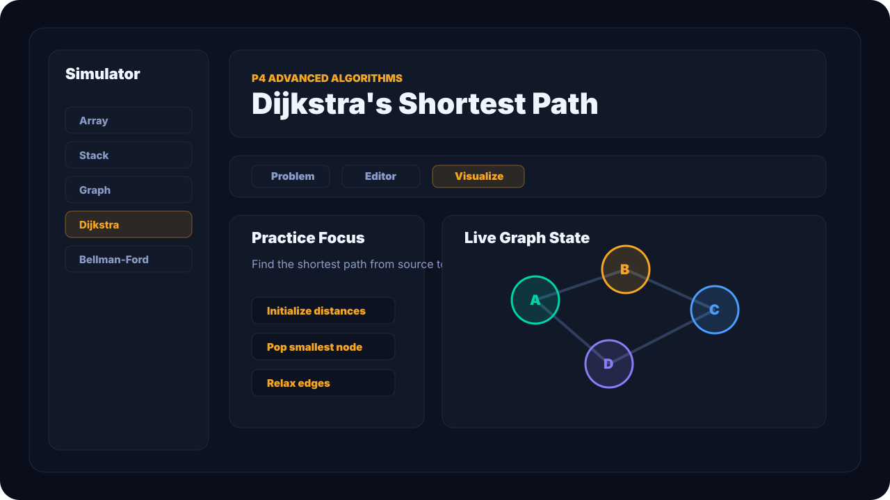
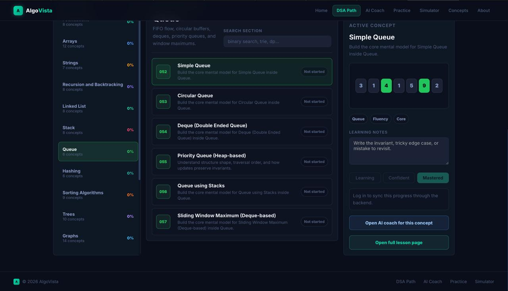

# AlgoVista


[](https://Alan-K-Biju-7.github.io/AlgoVista/)


**AlgoVista is a visual Data Structures and Algorithms learning platform built to help learners move from intuition to implementation.**

It combines concept lessons, algorithm visualizers, a NeetCode 150 practice deck, guided story mode, code tracing, test execution, mastery analytics, and an optional AI coach backend.

[](https://Alan-K-Biju-7.github.io/AlgoVista/)



## Why This Project Stands Out

Most DSA projects are either static notes, a basic algorithm animation, or a simple problem list. AlgoVista is built as a complete learning product:

- 18 interactive visual labs for arrays, stacks, queues, linked lists, trees, graphs, heaps, hashing, tries, sorting, and shortest paths.
- 150 curated coding missions with examples, hints, solutions, and executable test cases.
- Story Mode that explains the mental model before code.
- Trace Mode for supported problems, with visual state snapshots.
- Practice Command Center with mastery score, difficulty coverage, review queue, and a daily training plan.
- Progress export/import/reset for portable local learning state.
- DSA for Beginners roadmap with 100+ concepts.
- Optional Node backend for auth, synced progress, and live AI provider support.
- Static demo fallback so the deployed frontend still works in guest mode without backend setup.

## Platform Walkthrough

### Home Page

The landing page introduces AlgoVista's visual-first approach to DSA learning, combining concept learning, practice missions, AI coaching, and interactive simulators into a single platform.



---

### DSA Learning Path

A structured beginner-to-advanced roadmap containing 126+ concepts organized by topic. Learners can track mastery, confidence, and progress while moving through foundations, arrays, linked lists, trees, graphs, dynamic programming, and more.



---

### Practice Command Center

The practice hub is inspired by structured interview preparation systems. It includes curated NeetCode-style missions, mastery analytics, review queues, difficulty coverage, and recommended next problems.



**Highlights**

- 150 curated coding missions
- Story-mode learning workflow
- Review queue generation
- Mastery tracking
- Progress analytics
- Personalized recommendations

---

### AI Coach

The integrated AI Coach acts as a personalized DSA mentor. Learners can ask for intuition, dry runs, edge cases, complexity analysis, implementation guidance, and concept explanations.



**Capabilities**

- Beginner-friendly explanations
- Step-by-step dry runs
- Complexity breakdowns
- Edge case analysis
- Interview-style guidance
- Backend-powered AI integration

---

### Interactive Simulator Workspace

The simulator provides visual execution for core data structures and algorithms. Users can insert, delete, search, traverse, and observe algorithm behavior in real time.



**Available Visual Labs**

- Arrays
- Linked Lists
- Stacks
- Queues
- Binary Search Trees
- AVL Trees
- Heaps
- Hash Tables
- Tries
- Graph Algorithms
- Sorting Algorithms

---

### Concept Explorer

The concept explorer allows learners to browse concepts, track understanding levels, write learning notes, launch simulations, and open AI-assisted explanations directly from each lesson.



---

### Complete Learning Flow

AlgoVista combines four major learning pillars:

1. **Learn** → Concept Roadmap
2. **Understand** → AI Coach
3. **Visualize** → Interactive Simulators
4. **Practice** → NeetCode-Style Missions

This creates a complete path from first exposure to interview-level problem solving.


## Core Features

| Area | What It Does |
| --- | --- |
| DSA Path | Beginner-to-advanced concept roadmap with progress states |
| Concepts | Fast topic reference with complexity and simulator links |
| Simulator | Visual labs for data structures and algorithms |
| Practice | NeetCode 150-style mission deck with filters, bookmarks, tests, traces, and story mode |
| Command Center | Mastery analytics, review queue, training plan, and progress portability |
| AI Coach | Backend-powered coach with a static offline tutor fallback |
| Backend | Local Node API for auth, progress sync, and OpenAI-compatible coach providers |

## Tech Stack

- React 19
- React Router
- JavaScript
- CSS modules by feature area
- Create React App build pipeline
- Node.js backend using built-in `http`, `crypto`, and `fs`
- Local storage for guest practice progress
- File-backed backend storage for local authenticated progress

## Architecture

```text
src/
  components/
  context/
  data/
  layout/
  modules/
    array/
    avl/
    bellmanford/
    bst/
    dijkstra/
    graph/
    hashtable/
    heap/
    linkedlist/
    mergesort/
    quicksort/
    sorting/
    trie/
  pages/
    practice/
      neetcode150/
      tracer/
server/
  index.js
docs/
  assets/
```

## Local Setup

```bash
npm install
npm start
```

Open:

```text
http://localhost:3000
```

Optional backend:

```bash
npm run backend
```

Backend URL:

```text
http://127.0.0.1:8787
```

Optional AI provider:

```bash
cp server/.env.example server/.env
```

Then set:

```env
HOST=127.0.0.1
GEMINI_API_KEY=your_key_here
AI_PROVIDER_BASE_URL=https://generativelanguage.googleapis.com/v1beta/openai
AI_PROVIDER_MODEL=gemini-3.5-flash
```

Without provider keys, the backend returns a local fallback response. Without the backend, the deployed frontend still shows a static tutor fallback.

## Live Backend Setup

GitHub Pages can host the React frontend, but it cannot run the Node backend. To make the live demo support login, synced progress, and AI coaching, deploy `server/index.js` on a Node host and keep the AI key only in that host's environment variables.

Required backend environment:

```env
HOST=0.0.0.0
GEMINI_API_KEY=your_rotated_server_side_key
AI_PROVIDER_BASE_URL=https://generativelanguage.googleapis.com/v1beta/openai
AI_PROVIDER_MODEL=gemini-3.5-flash
```

After the backend is live, add this GitHub Actions repository variable:

```text
REACT_APP_API_BASE_URL=https://your-backend-url.example.com
```

Then rerun the GitHub Pages workflow. The frontend build will call that backend for auth, progress sync, and AI coaching.

Never commit API keys into the React app, README, or GitHub Pages build. Browser code is public.

## Testing

```bash
npm run test:ci
```

Current verification:

```text
12 test suites passed
55 tests passed
Production build compiled successfully
```

The test suite covers:

- Problem bank integrity
- Reference solution execution
- Practice filtering and sorting
- Story mode generation
- Visual step generation
- Trace engine behavior
- Practice progress persistence and import/export
- Route-level app flows
- API client error handling

## Production Build

```bash
npm run build:spa
```

This creates:

```text
build/
  index.html
  404.html
  static/
```

The `404.html` copy supports direct visits to client-side routes on static hosts.


- Built **AlgoVista**, a full-stack visual DSA learning platform with 18 interactive algorithm visualizers, a 150-problem practice deck, code tracing, test execution, and mastery analytics.
- Implemented a React-based learning workflow with Story Mode, visual state labs, practice filters, bookmarks, review queues, daily training plans, and local progress portability.
- Designed a Node.js backend with hashed-password auth, bearer-token sessions, file-backed progress sync, and an OpenAI-compatible AI coach endpoint with offline fallback.
- Added CI-ready tests covering problem-bank integrity, reference solution execution, tracer behavior, planner logic, route-level UI flows, API error handling, and local persistence.
- Prepared production deployment for GitHub Pages, Netlify, and Vercel with SPA route fallback and static-demo resilience.

## Repository Highlights

- `src/pages/PracticePage.jsx` - practice command center and mission workflow
- `src/pages/practice/practicePlanner.js` - recommendation, review queue, and training plan logic
- `src/pages/practice/testRunner.js` - in-browser JavaScript test runner for problem solutions
- `src/pages/practice/tracer/` - execution tracing and visualization utilities
- `src/modules/` - interactive DSA visualizers
- `server/index.js` - local backend for auth, progress, static hosting, and AI coaching
- `.github/workflows/deploy.yml` - GitHub Pages CI/CD
- `render.yaml` - Node backend deployment template
- `netlify.toml` and `vercel.json` - free static deployment config

---

<p align="center">
  <b>AlgoVista - Master DSA by watching it happen.</b>
</p>
